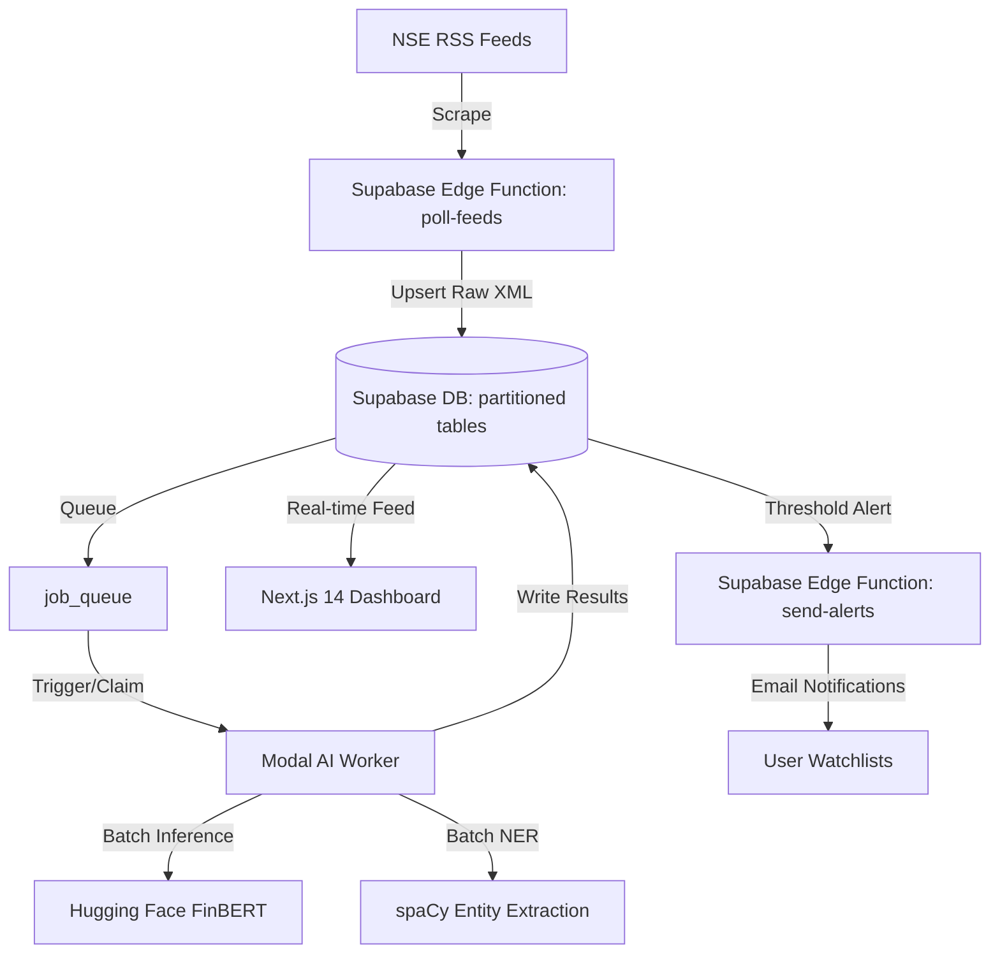

# 📈 NSE Sentiment Intelligence Platform

An end-to-end, high-frequency financial intelligence platform that performs real-time tracking, FinBERT-powered financial sentiment analysis, and entity extraction on official corporate filings published by the National Stock Exchange of India (NSE).

Designed with a premium glassmorphism dashboard UI, partitioned database architecture, and a serverless, batch-vectorized ML inference pipeline.

---

## 🏗️ Architecture & Technology Stack

The platform is designed as a modern monorepo separating scraping, serverless AI inference, database storage, and dashboard visualization:



### 💻 Frontend (Dashboard)
*   **Next.js 14 (App Router):** Fast SSR and dynamic feed streaming.
*   **Tailwind CSS:** Rich dark mode aesthetics with sleek gradients and glassmorphism.
*   **Lucide React:** Iconography.

### 🐍 AI Inference Engine (Serverless Worker)
*   **Modal (Python):** Serverless orchestration to scale model inference up and down instantly.
*   **Hugging Face Transformers:** Sentiment classification utilizing `ProsusAI/finbert`.
*   **spaCy (en_core_web_sm):** Natural Language Processing (NLP) for extracting ORG entities, tickers, and names.
*   **KeyBERT:** Document keyword/keyphrase extraction.

### 🗄️ Backend & Database
*   **Supabase (PostgreSQL):** Hosts table partitions, triggers, and Row Level Security.
*   **Table Partitioning:** Monthly range partitioning on high-frequency tables (`raw_feed` and `analyzed_events`) to maintain query speed at scale.
*   **Deno Edge Functions:**
    *   `poll-feeds`: Crawls active NSE archive endpoints.
    *   `send-alerts`: Cross-references watchlist alerts using the Resend email API.

---

## 📁 Repository Structure

```
nse-sentiment/
├── apps/
│   ├── web/                     # Next.js 14 Web Application & Dashboard
│   └── worker/                  # Modal Serverless Python Worker (ML Inference)
├── packages/
│   └── types/                   # Shared TypeScript Interfaces & Types
├── supabase/
│   ├── functions/               # Deno Edge Functions (Scrapers & Alerts)
│   ├── migrations/              # Database Schema & Partition Migrations
│   └── seed/                    # SQL Mock Seed Data
├── package.json                 # Monorepo configuration (npm workspaces)
├── turbo.json                   # Turborepo Build Cache Settings
└── vercel.json                  # Vercel Deployment Settings
```

---

## ⚡ Core Features & Optimizations

1.  **Correct Feed Ingestion:** Automatically fetches the 10 core NSE feed categories (Announcements, Financial Results, Annual Reports, Board Meetings, Corporate Governance, Corporate Action, Buybacks, Insider Trading, Shareholding Patterns, and Investor Complaints) from active archive endpoints.
2.  **Vectorized ML Batching:** Models process incoming jobs concurrently in a single forward pass, boosting throughput by using:
    *   `score_texts(list[str])` for sequence classification.
    *   spaCy's optimized `nlp.pipe` for batch entity recognition.
3.  **Parallel I/O Concurrency:** Database operations (raw feed fetches, results writing, job queue updates, and Webhook alert checking) run in parallel via `asyncio.gather`.
4.  **Database Scaling:** Implemented automated range partitioning to split the `raw_feed` and `analyzed_events` tables month-by-month.

---

## 🛠️ Local Setup & Commands

### 1. Monorepo Setup
Install Node dependencies and build the shared packages:
```bash
npm install
npm run build
```

### 2. Running Next.js Locally
Start the Next.js development server:
```bash
npm run dev
```

### 3. Deploying the AI Worker
First, ensure you are authenticated with Modal, then trigger the worker:
```bash
# Process jobs manually
python -m modal run main.py::process_jobs

# Run feed poll manually
python -m modal run main.py::test_trigger
```

---

## 📄 License
This project is licensed under the MIT License.
